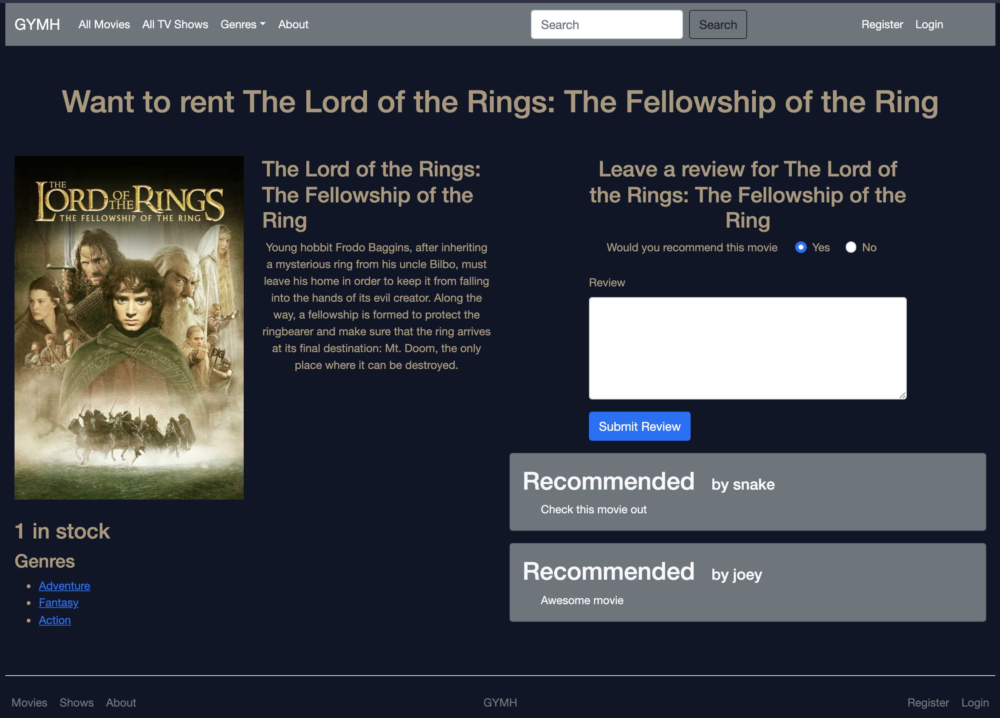
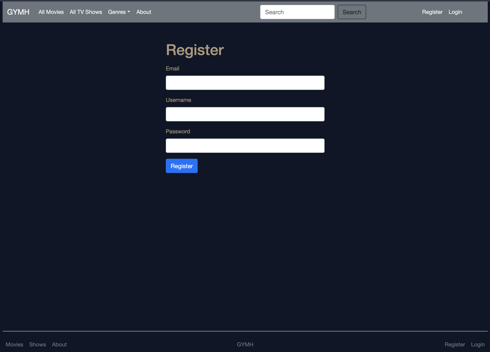
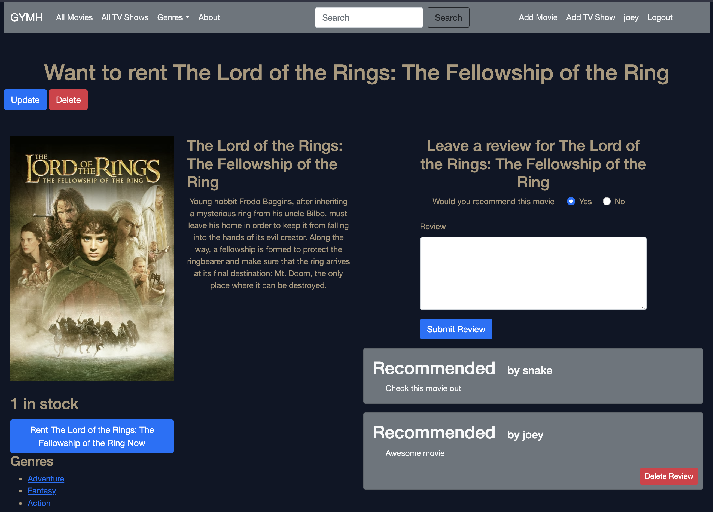
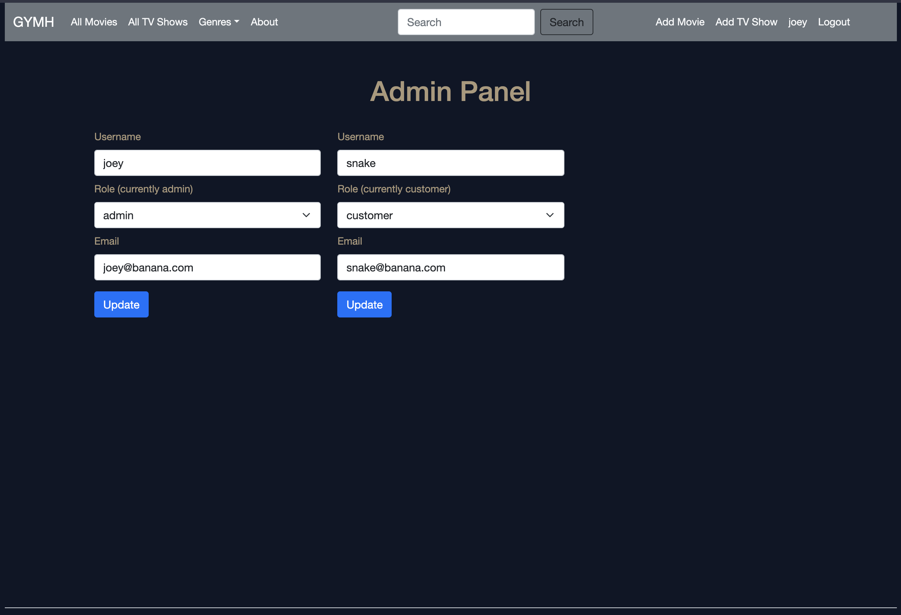
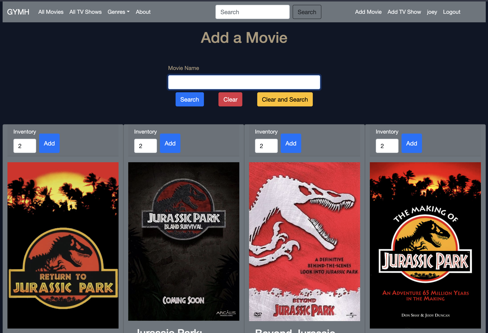

# Get Your Movies Here

Movie and TV show rental app. Create an account and rent some entertainment.

<p style="display: flex; justify-content: space-around;">


</p>

<p style="display: flex; justify-content: space-around;">


</p>

This is a sample node app that allows users to rent movies and TV shows and leave reviews.

The tech stack is Node, Express, and MongoDB on the back end with [Bootstrap](https://getbootstrap.com) on the front end. It uses [Mongoose](https://mongoosejs.com/) as the ODM, [EJS](https://ejs.co/) for templating, and [Passport](http://www.passportjs.org/) for authentication.

## Manual Dependencies

You will need to install:

- [Node](https://nodejs.org)
- [NPM](https://www.npmjs.com) (if you didn't install with Node)
- [MongoDB](https://www.mongodb.com) or use a Docker container

```
docker container run --name <container_name> -d -p 27017:27017 -v <directory_to_mongo_data>:/data/db mongo
```

You can find the directory that stores MongoDB data by looking at the mongo.conf file.

If you use a docker container for MongoDB and want to run the mongo shell through docker

```
docker container exec -it <container_name_from_previous_docker_command> bash
```

Once you connect to the Docker container running MongoDB, you can use `mongo` to launch the MongoDB shell.

If you install MongoDB locally, you can run the `mongo` command from a local terminal to launch the MongoDB shell.


Install project dependencies with NPM by running the following command in the root directory
```
npm install
```

Nodemon is installed as a local development dependency.

## .env file

The dotenv package uses a file named '.env' in the root of the project. This file is not under version control, so you will need to create it and add the following three environment variables:

- API_KEY: this is the key to access the TMDb movie API. You can get this key by signing up for an account and requesting an API key at 
[The Movie Database](https://www.themoviedb.org/)

```
echo 'API_KEY=put_your_tmdb_api_key_here' >> .env
```

- SESSION_SECRET: this is a random string that you pass into the secret option for the Express Session middleware in app.js

```
echo 'SESSION_SECRET=put_your_session_secret_string_here' >> .env
```

- DB_CONNECTION sets part of the MongoDB connection string in app.js. Set this value to 'localhost' if you are running the app locally, and set it to 'mongo' if you are running the app in a Docker container

```
echo 'DB_CONNECTION=localhost' >> .env
```

If you run the app as a docker container, you need to move this .env file into the same directory as the Dockerfile.

## Running the App

Before starting the app, make sure the MongoDB service is running.

Once the MongoDB service is up, use
```
npm run nodemon
```
in the app directory to start the app.

Open a web browser and go to localhost:3000 to access the app.

## Database Setup

This project uses five collections:

- moviegenres
- movies
- reviews
- shows
- users

You can view more info about each of these in the models directory.

The seed_data folder contains starter data and scripts to initially populate the database with movies, shows, and movie genres. The seed_all.js script contains all of the other scripts. You can comment/uncomment from that file or run each of the other scripts on their own.

You will need to run the script to populate the TMDb movie genres in order for other functionality to work.

You will populate users and reviews from the app interface.

Make sure the MongoDB service is running and then call the script with Node

```
node script_you_want_to_run.js
```

See the following [Admin Users](#admin-users) section for adding movies and shows through the app interface.

## Admin Users

The app has no users in the database by default. To create an admin account:

- run the app
- create a standard user with the Register feature
- go back to terminal and start the MongoDB shell by running
```
mongo
```

In the MongoDB shell:

- switch to the app database
```
use getyourmovieshere
```

- confirm you have the right user
```
db.users.findOne({"username": <user>})
``` 

Users are set with the role of customer by default. To promote a user from a customer to an administrator (role of "admin"):

```
db.users.updateOne({"username": <user>}, {$set: {"role": "admin"}})
```

\* substitute desired username in place of <user>

Once you have an administrator account, you can use the app interface to change other users to administrators or customers.

<p align="center"></p>

You reach this admin panel by clicking on your username in the navbar and clicking on the admin panel button in the upper-left. You can use this to change the role for other users.

<p align="center"></p>

Admins have two extra options in the navbar: Add Movie and Add TV Show. You can add new movies and TV shows through these pages. The search functionality populates results from the corresponding APIs with AJAX.

# APIs

Movie data and data sets come from the [API](https://developers.themoviedb.org/3/) from [The Movie Database](https://www.themoviedb.org/). This product uses the TMDb API but is not endorsed or certified by TMDb.

TV data and data sets come from the [API](https://www.tvmaze.com/api) from [TVmaze](https://www.tvmaze.com). The data is licensed under Creative Commons license [CC BY-SA 4.0](https://creativecommons.org/licenses/by-sa/4.0). Please note that the license for TVmaze data is different than that for the app. Please take appropriate measures to follow the licensing for TVmaze data.
